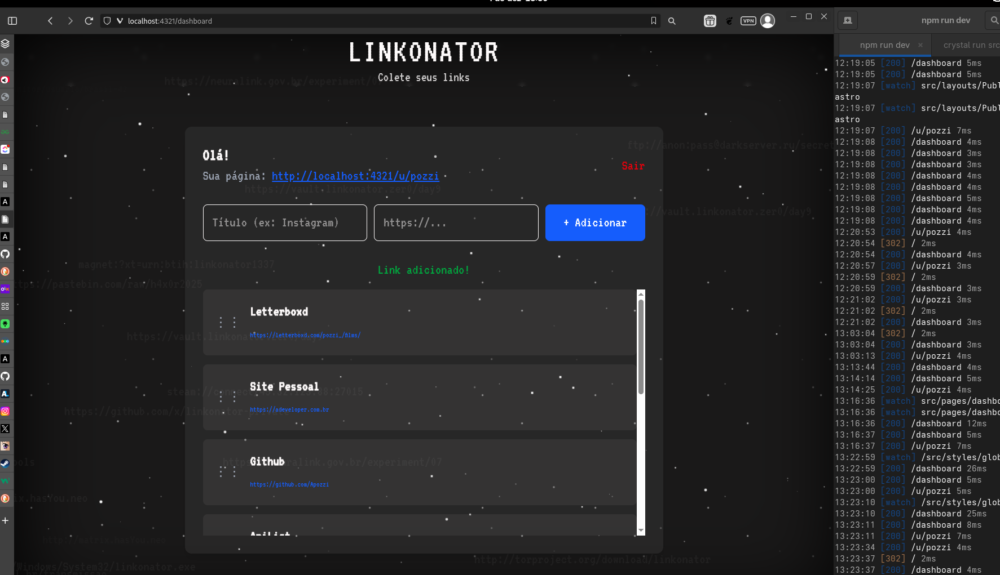
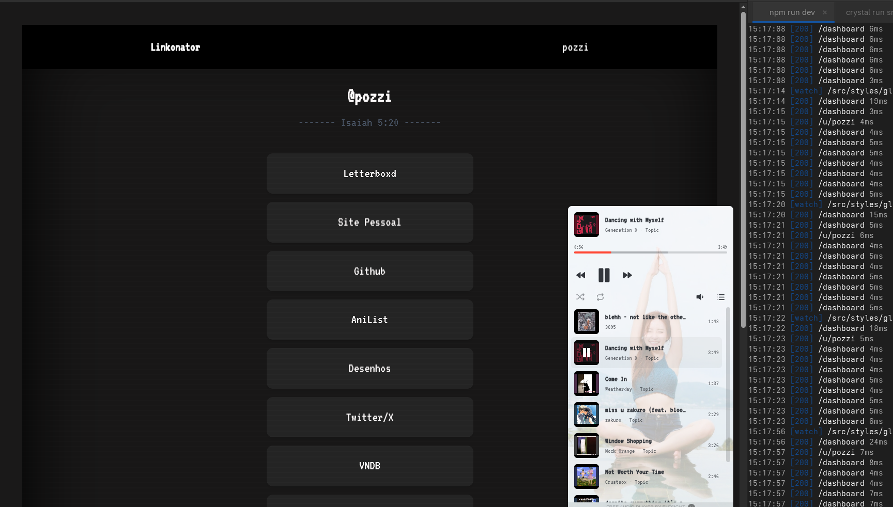
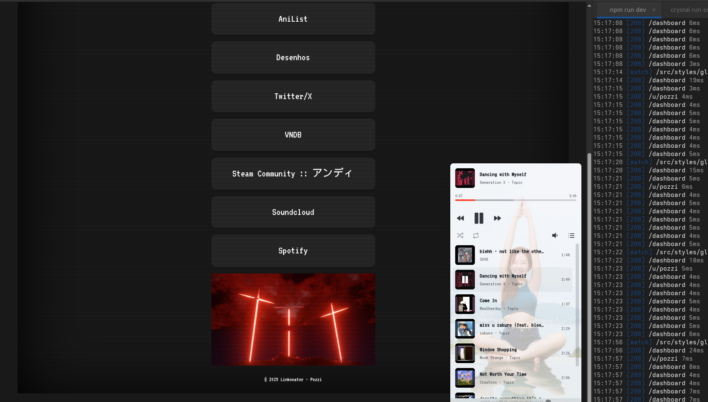

> "Há uma diferença entre conhecer o caminho… e caminhar pelo caminho."  
> — Morpheus

O LINKONATOR é um clone gerenciador de links estiloso.

## Preview

<div align="center">
  
  
  
</div>

<br>

## Funcionalidades

## Tech Stack

| Camada       | Tecnologia                          | Motivo                                      |
|--------------|-------------------------------------|---------------------------------------------|
| Frontend     | Astro 4 + HTMX + Alpine.js          | Build zero-JS, ilhas interativas, rápido    |
| Backend      | Crystal + Amyrist      | Velocidade insana + sintaxe limpa           |
| Banco        | PostgreSQL (prod)    | Simples e performático                      |
| Auth         | JWT + BCrypt (cost 10)              | Seguro e com patch $2a$ → $2y$ secreto      |

## Como rodar localmente

### Pré-requisitos
- Crystal 1.10+
- Node.js 18+
- shard.yml e package.json já estão no repo

### Passo a passo

```bash
# 1. Clone o repositório
git clone https://github.com/seuusuario/linkonator.git
cd linkonator

# 2. Backend (Crystal)
cd backend
shards install
crystal run src/linkonato.cr
# → roda em http://localhost:3000

# 3. Frontend (Astro) - em outro terminal
cd ../frontend
npm install
npm run dev
# → roda em http://localhost:4321
