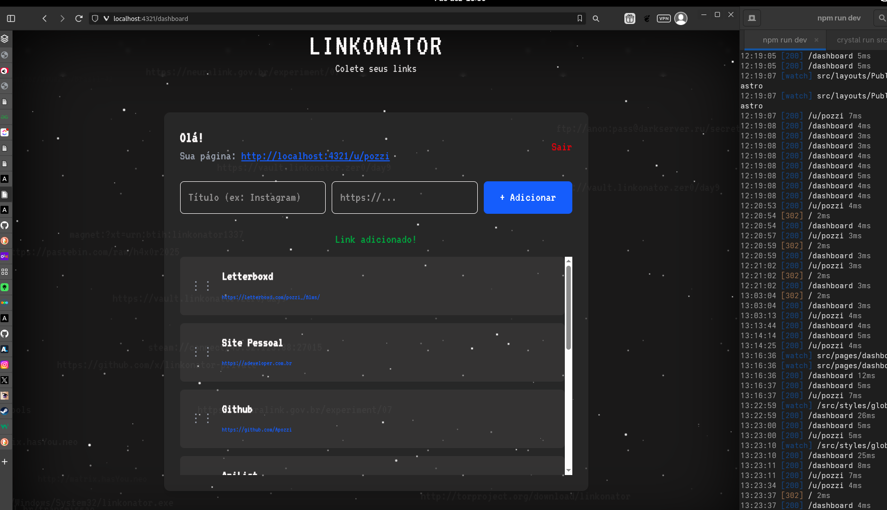

O LINKONATOR é um clone gerenciador de links estiloso, com player de música integrado.

## Preview

<div align="center">
  

  +++++++++

  
  

  +++++++++
   
  
</div>

<br>

## Funcionalidades

## Tech Stack

| Camada       | Tecnologia                          | Motivo                                      |
|--------------|-------------------------------------|---------------------------------------------|
| Frontend     | Astro 4 + HTMX          | Build zero-JS, ilhas interativas, rápido    |
| Backend      | Crystal + Amyrist      | Velocidade insana + sintaxe limpa           |
| Banco        | PostgreSQL (prod)    | Simples e performático                      |
| Auth         | JWT + BCrypt (cost 10)              | Seguro e com patch $2a$ → $2y$ secreto      |

## Como rodar localmente

### Pré-requisitos
- Docker
- Docker Compose

### Passo a passo

```bash
# 1. Clone o repositório
git clone https://github.com/seuusuario/linkonator-crystal-astro.git
cd linkonator-crystal-astro

# 2. Crie ou configure o arquivo .env

# 3. Inicie a aplicação com Docker Compose
docker compose up -d --build

# → Frontend roda em: http://localhost:4321
# → Backend roda em: http://localhost:3005

